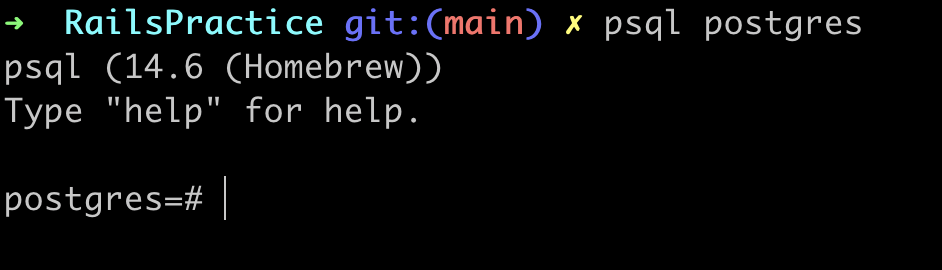

## **Ruby version:**

- 2.7.5

## **Rails version:**

- 7.0.4

## **Dependencies:**

- Git
- Yarn
- Ruby v2.7.5
- Rails v7.0.4
- Bundler
- PostgreSQL v15 - you may need to configure you system's $PATH after installing it to use the `psql` CLI. please refer to [this page](https://postgresapp.com/documentation/cli-tools.html) in order to do so
- Environment variables (please ask a developer for these)

## **Configuration:**

For the pg gem:

`gem install pg`

or on macOS with a Sillicon chip:

`sudo ARCHFLAGS="-arch x86_64" gem install pg`


For the Bundler gem:
```
gem install bundler
gem update bundler
bundle install
```

For the database configuration go to config/database.yml and use the following settings (make sure you have completed the step of asking a developer for the environment variables under the Dependencies section in order to use the database correctly):

```
development:
  <<: *default
  adapter: postgresql
  database: ENV['DATABASE_NAME']
  host: localhost
  encoding: unicode
  pool: 5
  host: localhost
  username: ENV['POSTGRES_USERNAME']
  password: ENV['POSTGRES_PASSWORD']
```

To configure it run:

`psql postgres` to log into the postgres service like so:



Then execute:
```
CREATE ROLE POSTGRES_USERNAME WITH LOGIN PASSWORD ‘POSTGRES_PASSWORD’;
ALTER ROLE newUser CREATEDB;
```
Replace `POSTGRES_USERNAME` and `POSTGRES_PASSWORD` with the corresponding environment variables under local_env.yml file. Also, note that the password should be a string

You can now run `\q` to quit and connect again with `psql postgres -U POSTGRES_USERNAME`. To check the existing roles you can type `/du`

After successfully connecting to the database with user/password run:
```
rails db:create
rails db:migrate
```
If there is need to populate the db with data then also run:
```
rails db:seed
```

## **How to run the test suite:**

For now just run `rspec` to run the tests

## **WIP**
For now that should be all that is needed to run this project. I just created it today in order to test this rails version and will (hopefully) be updating this in order to create a more complete project for the future and test more features too

If you encounter any issues while trying to run this project please don't hesitate to contact me

___

## **TODO:**
- Add basic tests
- README: Deployment instructions with CI/CD automation
- Add services (job queues, cache servers, search engines, etc.)
- Add Docker
